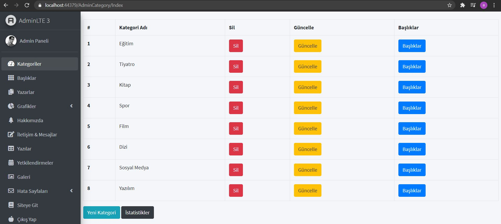
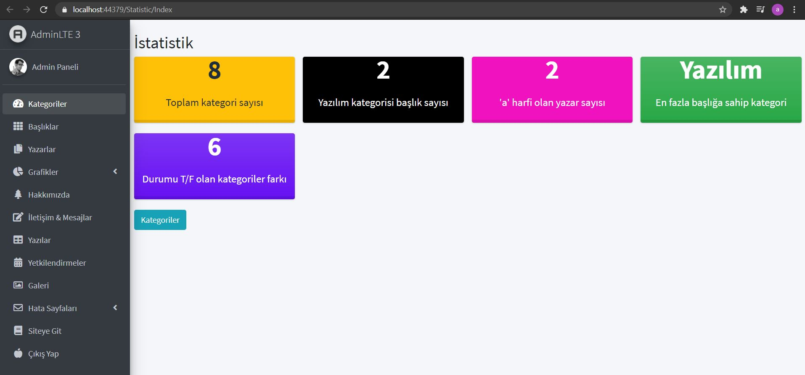

# Murat Yücedağ Mvc Proje Kampı
## 1. Görev
Kurumsal Mimari oluşturuldu. 20. derse kadar olan kısım güncellendi.
## 2. Görev
40. derse kadar olan kısım güncellendi ve aşağıdaki LINQ sorguları eklendi.
* Toplam kategori sayısı
* Başlık tablosunda "yazılım" kategorisine ait başlık sayısı
* Yazar adında 'a' harfi geçen yazar sayısı
* En fazla başlığa sahip kategori adı
* Kategori tablosunda durumu true olan kategoriler ile false olan kategoriler arasındaki sayısal fark

55. Ders Ödevi
* Durum kısmı renklendirmesi (switch case ifadesi ile) gerçekleştirildi.
* True-False durumuna göre button üzerindeki değişikler gerçekleştirildi.

60.Ders Ödevi
* Contact sayfasındaki SideBar Partial olarak tutuldu.

64. Ders Ödevi
* ContactSideBarPartial view içerisinde mesaj sayıları gösterildi.
* Tasklaklara kaydet işlemi yapıldı.
* Summernote ödevi henüz yapılmadı.
